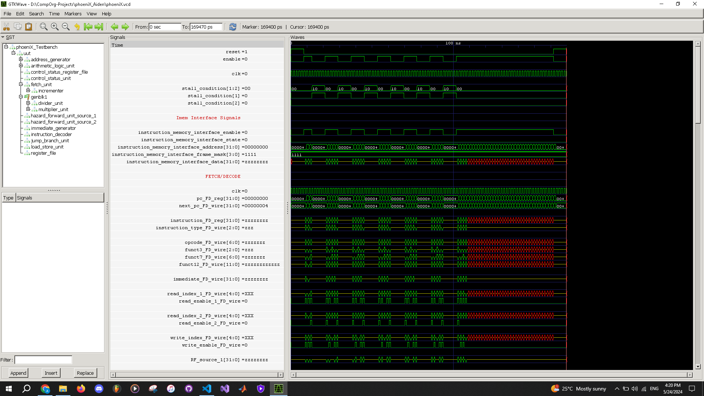
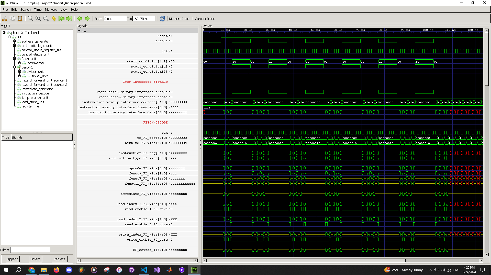

Computer Organization - Spring 2024

==============================================================

## Iran Univeristy of Science and Technology

## Assignment 1: Assembly code execution on phoeniX RISC-V core

- Name:Amir Mohammad Emam

- Team Members:Sara Dadkhoo , Matin Rahmati

- Student ID:400411144

- Date:1403/03/04

## Report

    *                *********** Second Project ***********                *

1. **Loading the Input Integer**:

   `li a0, 25`: This instruction loads the input integer, in this case, 25, into register `a0`.
   This integer represents the value for which we want to find the integer square root.

2. **Initialize Result to 0**:
   `li t0, 0`: This instruction initializes the result to 0. The result register `t0` will be
   used to store the current guess for the integer square root.

3. **Loop for Computing the Square Root**:

   `loop:`: This label marks the beginning of the loop for computing the square root.
   `mul t1, t0, t0`: This instruction computes the square of the current result (`t0`) and
   stores it in register `t1`.
   `bge t1, a0, end`: This branch instruction checks if the squared result (`t1`) is greater
   than or equal to the input integer (`a0`). If true, the loop exits, and execution jumps
   to the `end` label.

   `addi t0, t0, 1`: If the condition is not met, this instruction increments the result (`t0`)
   by 1.

   `j loop`: This unconditional jump instruction jumps back to the beginning of the loop to repeat
   the process until the square of the current result exceeds or equals the input integer.

4. **End of Loop, Compute the Integer Square Root**:

   `end:`: This label marks the end of the loop.

   `addi t0, t0, -1`: This instruction subtracts 1 from the current result (`t0`) to obtain the
   integer square root. It's done by adding a negative immediate value to `t0`, effectively
   decrementing it by 1.

5. **Exit the Program**:

   `ebreak`: This instruction is used to terminate the program. When executed, it signals the
   end of the program to the simulator.

   In summary, the code iteratively computes the integer square root of the input integer by
   incrementing a guess (`t0`) until its square exceeds or equals the input. Then, it decrements
   the guess by 1 to obtain the integer square root and terminates the program.

